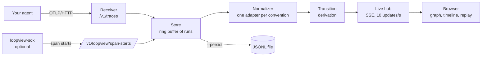

# loopview


loopview shows what your AI agents are doing as a live graph: which agent or node is running, which tools it calls, what comes back, and where control goes next.

## Why

Most tracing tools show agent runs as trees, waterfalls and lists. Those are good for reading a run after the fact. loopview draws the run as a graph that builds itself while the agent runs: agents are groups, steps are nodes, control flow travels along the edges, tool calls fire next to the step that made them, loops show as an edge back with a counter. It works with any framework that emits OpenTelemetry traces, and it runs on your machine with no account and no cloud.

## Quick start

```sh
uvx loopview demo
```

(Until the package is on PyPI, run it from a checkout: see [Development](#development).)

This opens the browser on a recorded run of the flagship demo: a supervisor, three analysts working in parallel, a tool that fails and is retried, a critic that sends the work back once, and a handoff to a writer. No API key needed. Press space to replay it.

To watch your own agent:

```sh
uvx loopview            # UI and OTLP endpoint on http://127.0.0.1:4318
```

then, in the shell that runs your agent:

```sh
export OTEL_EXPORTER_OTLP_TRACES_ENDPOINT=http://127.0.0.1:4318/v1/traces
export OTEL_BSP_SCHEDULE_DELAY=100
```

and run it. `loopview --help` lists the options (`--port`, `--persist FILE` to keep runs across restarts, `--max-runs`).

loopview accepts OTLP over HTTP (protobuf or JSON). If your setup uses the gRPC exporter, switch to the HTTP one (`opentelemetry-exporter-otlp-proto-http` in Python).

## Setup per framework

Every setup is the same idea: make your framework emit OpenTelemetry spans and send them to loopview with the standard OTLP/HTTP exporter. The examples in [`examples/`](examples/) are complete, runnable versions; the ones marked "tested" have a recorded trace in [`fixtures/`](fixtures/) that the test suite runs against.

The common part, in Python:

```python
from opentelemetry import trace
from opentelemetry.exporter.otlp.proto.http.trace_exporter import OTLPSpanExporter
from opentelemetry.sdk.trace import TracerProvider
from opentelemetry.sdk.trace.export import BatchSpanProcessor

provider = TracerProvider()
provider.add_span_processor(BatchSpanProcessor(OTLPSpanExporter()))  # reads the env vars above
trace.set_tracer_provider(provider)
```

**LangGraph and LangChain** (tested, OpenInference). Install `openinference-instrumentation-langchain`, then:

```python
from openinference.instrumentation.langchain import LangChainInstrumentor
LangChainInstrumentor().instrument(tracer_provider=provider)
```

Graph nodes, conditional routing, loops and subgraphs are recognised from LangGraph's run metadata. See `examples/langgraph_router.py` and `examples/demo/flagship.py`.

**Pydantic AI** (tested, OpenTelemetry GenAI conventions, built in):

```python
from pydantic_ai import Agent
Agent.instrument_all()
```

See `examples/multi_agent_pydantic.py` (agents delegating in parallel, then a handoff).

**Anthropic SDK, hand-rolled agent loop** (tested). Wrap your loop in spans that follow the GenAI conventions: `invoke_agent {name}` around the run, `chat {model}` around each model call, `execute_tool {tool}` around each tool. `examples/react_anthropic.py` is a complete, commented example.

**OpenAI SDK.** Install `openinference-instrumentation-openai` and call `OpenAIInstrumentor().instrument(tracer_provider=provider)`.

**OpenAI Agents SDK.** Install `openinference-instrumentation-openai-agents` and call `OpenAIAgentsInstrumentor().instrument(tracer_provider=provider)`.

The last two follow the same OpenInference conventions as the tested LangGraph path but have no recorded fixture yet.

**Anything that speaks OpenTelemetry.** Spans that follow the GenAI conventions (`gen_ai.*`) or OpenInference (`openinference.span.kind`) are understood. Any other span is still shown, as a generic step with its attributes, never dropped. A plain HTTP service with OpenTelemetry tracing shows up as a graph of its operations.

## How it works



1. **Receiver.** Decodes OTLP export requests (protobuf or JSON, gzip or not) into raw spans.
2. **Store.** Groups spans into runs by trace id and runs into sessions by `gen_ai.conversation.id` or `session.id`. Keeps the most recent 200 runs in memory; `--persist` also appends every request to a JSONL file.
3. **Normalizer.** Turns raw spans from any convention into one small schema the UI understands: agents, nodes, model calls, tool calls, and unknown steps. There is one adapter per convention (`gen_ai`, `openinference`, `generic`); adding a convention means adding one adapter.
4. **Transitions.** Derived from timing and nesting with one rule: within the same agent or graph, step A leads to step B when A ended before B started and no other step sits between them. That rule produces sequences, parallel fan out and fan in, loops (an edge back to a node that already ran) and handoffs.
5. **Live hub.** Every 100 ms, re-normalizes the runs that changed and pushes only the steps that changed to the browser over Server-Sent Events.
6. **UI.** React and React Flow, laid out with ELK in a Web Worker. Replay rebuilds the graph at any moment from span timestamps.

## Liveness: what "live" means

Standard OpenTelemetry exporters send a span only when it ends. A live view also needs to know when a step starts. loopview handles this in two layers.

**With any exporter (default).** Children end before their parents, so when a child span arrives for a parent loopview hasn't seen, the parent must still be running. loopview shows it as running, named from what the child tells it (LangGraph metadata names the node, GenAI attributes name the agent). The cost: a step with no finished children is invisible until it ends, and updates arrive in batches. Set `OTEL_BSP_SCHEDULE_DELAY=100` so batches go out every 100 ms instead of the default 5 s.

**With `loopview-sdk` (optional).** A tiny span processor that also reports when each span starts:

```python
from loopview_sdk import LiveStartProcessor
provider.add_span_processor(LiveStartProcessor())
```

Steps then light up the moment they begin, with their real names. It sends from a background thread and drops reports if loopview isn't running, so it never slows the agent down. Some instrumentations (OpenInference for LangChain) only set attributes when a span ends; for those, a started step is shown by position (a direct child of a graph or agent) and gets its full detail when it ends.

## Replay, import and export

Any finished run can be replayed at 0.5x, 1x, 2x or 4x with a scrubber. Replay uses span timestamps, so it shows what really happened, without the exporter's batching delays. Runs export as JSONL (one OTLP request per line) and import through the run list, so you can share a trace.

Keyboard: `space` play or pause, `left` and `right` step through events, `f` fit the graph to the screen, `esc` close the details panel.

## Limitations

- OTLP over HTTP only; gRPC is not supported yet.
- Transitions are inferred from timing and nesting. When two sibling steps have identical timestamps (coarse clocks), their order can be ambiguous.
- Traces that span several services: a span whose parent lives in another service is shown under an inferred parent named after the service.
- Without `loopview-sdk`, a running step with no finished children is not visible until it ends.
- Message content is shown only if your instrumentation records it (both conventions make it opt-in).
- Runs are kept in memory (200 by default); use `--persist` to keep them across restarts.

## Development

Requirements: Python 3.11+, [uv](https://docs.astral.sh/uv/), Node 22+.

```sh
cd ui && npm install && npm run build      # builds the UI into the Python package
cd ../server && uv run loopview demo       # http://127.0.0.1:4318
```

For UI work with hot reload, keep the server running and run `npm run dev` in `ui/`.

| Part | What | Tests |
|---|---|---|
| `server/` | receiver, store, normalizer, transitions, live hub, CLI | `uv run pytest` |
| `ui/` | React UI | `npm test` (Vitest) |
| `sdk/` | `loopview-sdk` | `uv run pytest` |
| `examples/` | example agents, flagship demo, fixture capture | needs `ANTHROPIC_API_KEY` |
| `fixtures/` | traces recorded from real framework runs | used by server and UI tests |

Design decisions, with what was rejected and why, are in [DECISIONS.md](DECISIONS.md).

## Roadmap

- OTLP over gRPC.
- Fixtures for the OpenAI SDK, OpenAI Agents SDK and more frameworks.
- Light theme polish.
- A TypeScript `loopview-sdk` for Node agents.
- Diffing two runs of the same agent.

## License

Apache-2.0
