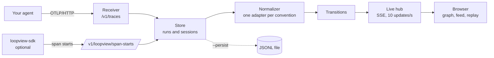

<div align="center">


# loopview

**Watch your AI agents run as a live graph, from any OpenTelemetry trace.**

See which agent is working, what it thinks, which tools it calls, what comes back, and where control goes next. While it happens.

[](https://github.com/YasmineZerai/loopview/actions/workflows/ci.yml)
[](LICENSE)


[**Try the live demo**](https://yasminezerai.github.io/loopview/) · [Quick start](#quick-start) · [Connect your agent](#connect-your-agent) · [How it works](#how-it-works) · [Design decisions](DECISIONS.md)

<br>


</div>

<br>

## Why loopview

Agent runs are hard to follow. An agent decides on its own which tool to call, loops, hands off to another agent, or splits work across several agents running in parallel. Most tracing tools show this as a tree or a waterfall, which is good for reading a run after the fact and poor at showing the *flow*.

loopview draws the run as a graph that builds itself while the agent runs:

- **Agents are groups, steps are cards**, each agent in its own colour.
- **Control flow moves along the edges.** Parallel branches run side by side, loops show as an arc back with a counter, handoffs as an edge between agents.
- **Tool calls fire next to the step that made them**, and a failed call turns red.
- **Every step can be opened** to read its thinking, its replies, and each tool call's arguments and result, right in the graph.
- **Any run can be replayed** at 0.5x to 4x, with the graph and the activity feed on the same clock.
- **A cost tree shows where the money goes**: the run branches into agents and steps, each branch as thick as its cost, down to what the tokens were spent on.

It works with **any framework that emits OpenTelemetry traces** (LangGraph, Pydantic AI, the OpenAI and Anthropic SDKs, or your own code), and it runs **on your machine**: one command, no account, no database, nothing sent anywhere.

## See it

<table>
  <tr>
    <td width="50%"></td>
    <td width="50%"></td>
  </tr>
  <tr>
    <td><b>Parallel agents, live.</b> Three analysts work at the same time. The feed on the right shows what each one thinks, says and does.</td>
    <td><b>Open any step.</b> Its thinking, replies, and every tool call with arguments and results, inside the graph.</td>
  </tr>
  <tr>
    <td width="50%"></td>
    <td width="50%"></td>
  </tr>
  <tr>
    <td><b>Agents inside agents.</b> A coordinator delegates to two researchers in parallel, then hands off to a writer.</td>
    <td><b>Timeline and replay</b>, one lane per agent, in light or dark.</td>
  </tr>
</table>

Or skip the screenshots: [**open the live demo**](https://yasminezerai.github.io/loopview/) in your browser. It replays recorded runs, nothing to install.

## Where the money goes


Press <kbd>c</kbd> and the run becomes a tree: the trunk branches into agents and their steps, each branch as thick as the money flowing through it, and any step opens into what its tokens went to (system prompt, tool definitions, history, tool results, cache reads and writes, thinking, reply), each in its own colour. Totals are the token counts your provider reported, priced from an editable file; the split between them is estimated from the recorded content, and whatever can't be explained is shown as "unattributed" rather than guessed.

## Quick start

Requirements: Python 3.11+, [uv](https://docs.astral.sh/uv/) and Node 22+ (Node only to build the UI once).

```sh
git clone https://github.com/YasmineZerai/loopview
cd loopview/ui && npm install && npm run build
cd ../server && uv run loopview demo
```

Your browser opens on a recorded multi-agent run. No API key needed. Press <kbd>space</kbd> to replay it.

To watch your own agent, start it without `demo`:

```sh
uv run loopview      # UI and OTLP endpoint on http://127.0.0.1:4318
```

and point your agent's exporter at it (next section). Once published to PyPI, this becomes `uvx loopview`.

## Connect your agent

loopview receives standard OpenTelemetry traces at **`http://127.0.0.1:4318/v1/traces`** (OTLP over HTTP). Your agent needs two things: an OpenTelemetry exporter pointed there, and tracing turned on for its framework.

**1. Install and set up the exporter** (once, at the start of your program):

```sh
pip install opentelemetry-sdk opentelemetry-exporter-otlp-proto-http
```

```python
from opentelemetry import trace
from opentelemetry.sdk.trace import TracerProvider
from opentelemetry.sdk.trace.export import BatchSpanProcessor
from opentelemetry.exporter.otlp.proto.http.trace_exporter import OTLPSpanExporter

provider = TracerProvider()
provider.add_span_processor(BatchSpanProcessor(
    OTLPSpanExporter(endpoint="http://127.0.0.1:4318/v1/traces"),
    schedule_delay_millis=100,  # send every 100 ms instead of every 5 s
))
trace.set_tracer_provider(provider)
```

**2. Turn on tracing for your framework:**

<details>
<summary><b>LangGraph / LangChain</b> (tested)</summary>

```sh
pip install openinference-instrumentation-langchain
```

```python
from openinference.instrumentation.langchain import LangChainInstrumentor
LangChainInstrumentor().instrument(tracer_provider=provider)
```

Graph nodes, conditional routing, loops and subgraphs are recognised from LangGraph's run metadata. Examples: [`examples/langgraph_router.py`](examples/langgraph_router.py), [`examples/demo/flagship.py`](examples/demo/flagship.py).
</details>

<details>
<summary><b>Pydantic AI</b> (tested)</summary>

```python
from pydantic_ai import Agent
Agent.instrument_all()
```

Pydantic AI emits the OpenTelemetry GenAI conventions natively. Example: [`examples/multi_agent_pydantic.py`](examples/multi_agent_pydantic.py).
</details>

<details>
<summary><b>Anthropic SDK, or your own agent loop</b> (tested)</summary>

Wrap your loop in spans that follow the OpenTelemetry GenAI conventions: `invoke_agent {name}` around the run, `chat {model}` around each model call, `execute_tool {tool}` around each tool. [`examples/react_anthropic.py`](examples/react_anthropic.py) is a complete, commented example, including extended thinking.
</details>

<details>
<summary><b>OpenAI SDK</b></summary>

```sh
pip install openinference-instrumentation-openai
```

```python
from openinference.instrumentation.openai import OpenAIInstrumentor
OpenAIInstrumentor().instrument(tracer_provider=provider)
```
</details>

<details>
<summary><b>OpenAI Agents SDK</b></summary>

```sh
pip install openinference-instrumentation-openai-agents
```

```python
from openinference.instrumentation.openai_agents import OpenAIAgentsInstrumentor
OpenAIAgentsInstrumentor().instrument(tracer_provider=provider)
```
</details>

<details>
<summary><b>Anything else that speaks OpenTelemetry</b></summary>

Spans that follow the GenAI conventions (`gen_ai.*`) or OpenInference (`openinference.span.kind`) are understood. Any other span is still shown, as a generic step with its attributes. Nothing is dropped.
</details>

**3. Run your agent.** It appears in loopview's run list and the graph builds itself as it runs.

<details>
<summary><b>Nothing shows up?</b></summary>

- The endpoint must end in `/v1/traces`, and the exporter must be the **HTTP** one (`...otlp.proto.http...`), not gRPC.
- The setup must run before your agents or LLM clients are created.
- Short scripts can exit before spans are sent: call `provider.shutdown()` at the end.
- The top right of loopview should say "connected".
</details>

## How it works



1. **Receiver.** Decodes OTLP export requests (protobuf or JSON) into raw spans.
2. **Store.** Groups spans into runs by trace id, and runs into sessions by conversation id. Keeps the 200 most recent runs in memory; `--persist FILE` also saves them to a file.
3. **Normalizer.** Every framework describes the same things differently. One adapter per convention (`gen_ai`, `openinference`, `generic`) turns spans into one small schema: agents, steps, model calls (with messages and thinking) and tool calls (with arguments and results).
4. **Transitions.** No framework says "control went from A to B", so loopview derives it with one rule: within the same agent or graph, A leads to B when A ended before B started and no other step sits between them. That one rule gives sequences, parallel fan out and fan in, loops and handoffs.
5. **Live hub.** Every 100 ms, pushes the steps that changed to the browser over Server-Sent Events.
6. **UI.** React and React Flow, laid out with ELK in a Web Worker. The graph is computed for a moment in time, so live view and replay are the same code.

Every design choice, with the alternatives that were rejected and why, is in [DECISIONS.md](DECISIONS.md).

### Live, even though spans arrive at the end

Standard OpenTelemetry exporters send a span only when it **ends**, but a live view needs to know when a step **starts**. loopview handles this in two layers:

- **With any exporter.** A child ends before its parent, so when a child arrives for a parent loopview hasn't seen yet, the parent must still be running. loopview shows it as running, named from what the child tells it.
- **With `loopview-sdk` (optional).** A small span processor that also reports when each span starts, so steps light up the moment they begin:

  ```python
  from loopview_sdk import LiveStartProcessor
  provider.add_span_processor(LiveStartProcessor())
  ```

  It sends from a background thread and silently drops reports if loopview isn't running, so it never slows your agent down.

## Using it

| Key | Does |
|---|---|
| <kbd>space</kbd> | play or pause the replay |
| <kbd>←</kbd> <kbd>→</kbd> | step through events |
| <kbd>e</kbd> | open or close every step in the graph |
| <kbd>a</kbd> | show or hide the activity feed |
| <kbd>c</kbd> | switch between the graph and the cost tree |
| <kbd>t</kbd> | show or hide the timeline |
| <kbd>f</kbd> | fit the graph to the screen |
| <kbd>esc</kbd> | close the details panel |

Runs can be exported as JSONL and imported by someone else, so you can share a trace. `loopview --help` lists the server options (`--port`, `--persist FILE`, `--max-runs`, `--prices FILE`).

Prices live in [`pricing.json`](server/src/loopview/cost/pricing.json), with a source link and the date each was checked. To add a model or correct a price, pass your own file with `--prices FILE`; its entries override the built-in ones. Models with no price are shown in tokens only.

## Limitations

- OTLP over HTTP only; gRPC is not supported yet.
- Transitions are inferred from timing and nesting. Sibling steps with identical timestamps can be ordered ambiguously.
- A span whose parent lives in another service is shown under an inferred parent named after that service.
- Without `loopview-sdk`, a running step with no finished children appears only when it ends.
- Message content and thinking appear only if your instrumentation records them. For LangChain, thinking is read from the raw model output, because OpenInference's message attributes drop it.
- Runs are kept in memory (200 by default); use `--persist` to keep them across restarts.
- The cost split is an estimate: tokens are approximated from characters (about 4 per token for prose, 3 for JSON), then scaled to the reported totals. The totals themselves are exact. Prices cover Anthropic models for now, and use the 5 minute cache write rate.
- Calls without recorded content show their total cost but no split. Calls whose framework reports no token counts are listed but not counted.

## Development

| Part | What | Tests |
|---|---|---|
| [`server/`](server/) | receiver, store, normalizer, transitions, live hub, CLI | `uv run pytest` |
| [`ui/`](ui/) | React UI | `npm test` (Vitest) |
| [`sdk/`](sdk/) | `loopview-sdk` | `uv run pytest` |
| [`examples/`](examples/) | example agents, flagship demo, fixture capture | needs `ANTHROPIC_API_KEY` |
| [`fixtures/`](fixtures/) | traces recorded from real framework runs | used by server and UI tests |

For UI work with hot reload, keep the server running and run `npm run dev` in `ui/`. See [CONTRIBUTING.md](CONTRIBUTING.md) for the rest.

## Roadmap

- Publish to PyPI, so it starts with `uvx loopview`.
- OTLP over gRPC.
- Recorded fixtures for the OpenAI SDK, the OpenAI Agents SDK and more frameworks.
- A TypeScript `loopview-sdk` for Node agents.
- Comparing two runs of the same agent side by side.
- Cost per tool: how much each tool's definition and results cost across a run.
- Prices for OpenAI, Google and other providers.

## License

[Apache-2.0](LICENSE)
