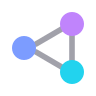
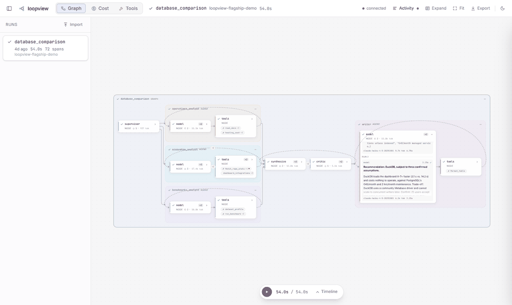
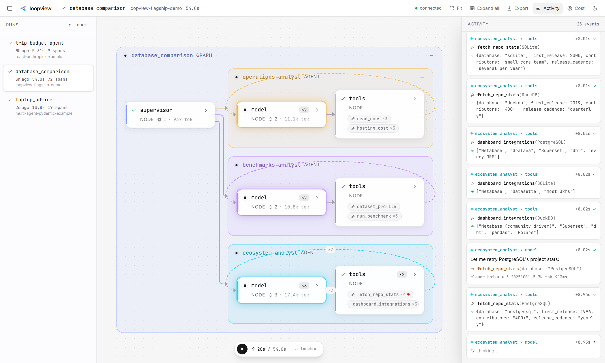
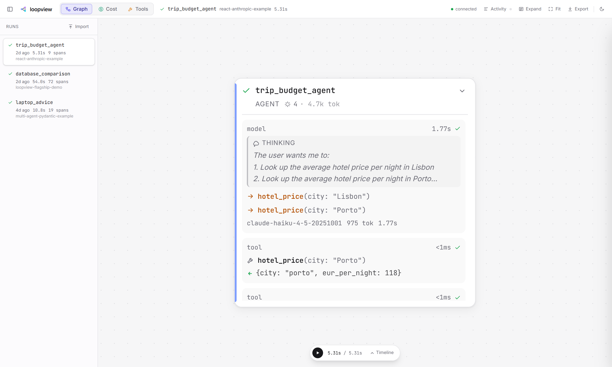
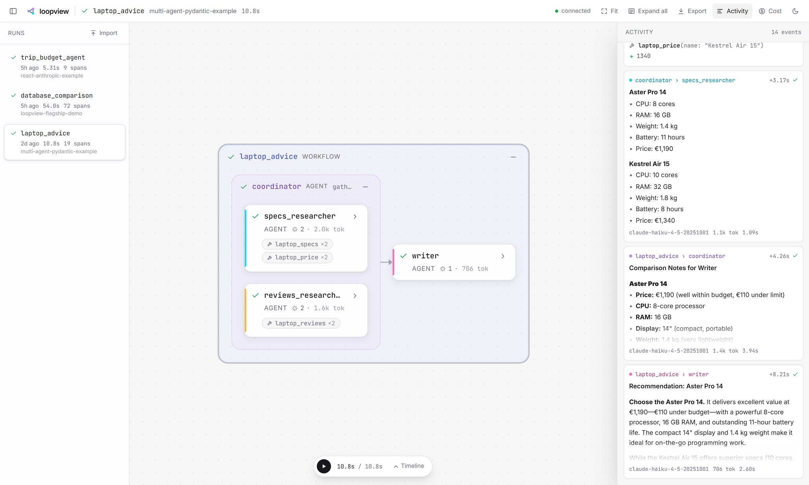
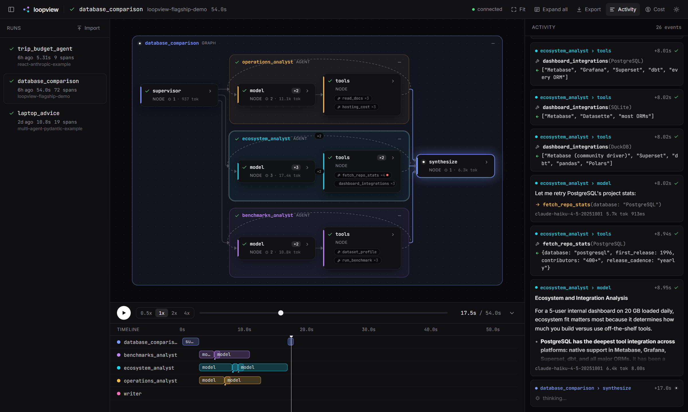
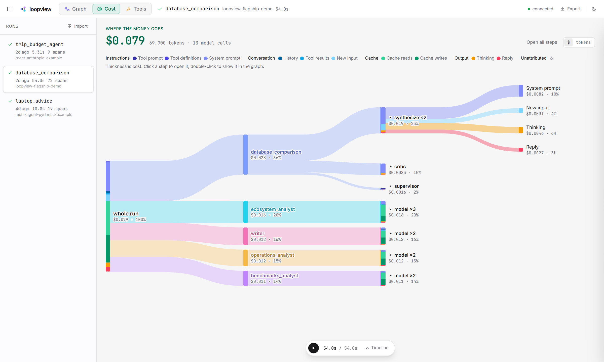
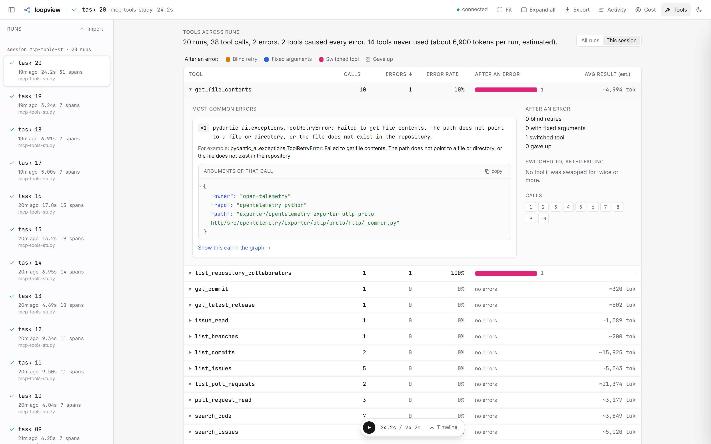
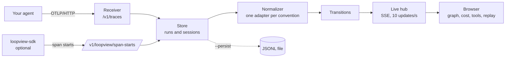

<div align="center">



# loopview

**Watch your AI agents run as a live graph, from any OpenTelemetry trace.**

See which agent is working, what it thinks, which tools it calls, what comes back, and where control goes next. While it happens.

[](https://github.com/YasmineZerai/loopview/actions/workflows/ci.yml)
[](LICENSE)


[**Try the live demo**](https://yasminezerai.github.io/loopview/) · [Quick start](#quick-start) · [Connect your agent](#connect-your-agent) · [How it works](#how-it-works) · [Design decisions](DECISIONS.md)

<br>



</div>

<br>

## Why loopview

Agent runs are hard to follow. An agent decides on its own which tool to call, loops, hands off to another agent, or splits work across several agents running in parallel. Most tracing tools show this as a tree or a waterfall, which is good for reading a run after the fact and poor at showing the *flow*.

loopview draws the run as a graph that builds itself while the agent runs:

- **Agents are groups, steps are cards**, each agent in its own colour.
- **Control flow moves along the edges.** Parallel branches run side by side, loops show as an arc back with a counter, handoffs as an edge between agents.
- **Tool calls fire next to the step that made them**, and a failed call turns red.
- **Every step can be opened** to read its thinking, its replies, and each tool call's arguments and result, right in the graph. With **Activity** on, the running cards open by themselves and close when they're done, and the view zooms in on them. Clicking a card zooms to it.
- **Any run can be replayed** at 0.5x (the default), 1x or 2x, with everything in the graph on the same clock.
- **A cost tree shows where the money goes**: the run branches into agents and steps, each branch as thick as its cost, down to what the tokens were spent on.
- **A Tools tab shows which tools an agent struggles with** across many runs: how often each fails, what the agent does next, and which tools it is offered but never uses.

It works with **any framework that emits OpenTelemetry traces** (LangGraph, Pydantic AI, the OpenAI and Anthropic SDKs, or your own code), and it runs **on your machine**: one command, no account, no database, nothing sent anywhere.

## See it

<table>
  <tr>
    <td width="50%"></td>
    <td width="50%"></td>
  </tr>
  <tr>
    <td><b>Parallel agents, live.</b> Three analysts work at the same time. With Activity on, the cards show what each one thinks, says and does, and the view follows the one that's running.</td>
    <td><b>Open any step.</b> Its thinking, replies, and every tool call with arguments and results, inside the graph.</td>
  </tr>
  <tr>
    <td width="50%"></td>
    <td width="50%"></td>
  </tr>
  <tr>
    <td><b>Agents inside agents.</b> A coordinator delegates to two researchers in parallel, then hands off to a writer.</td>
    <td><b>Timeline and replay</b>, one lane per agent, in light or dark.</td>
  </tr>
</table>

Or skip the screenshots: [**open the live demo**](https://yasminezerai.github.io/loopview/) in your browser. It replays recorded runs of five example agents, each with the prompt it was given, and a one-minute guided tour shows where to click. Nothing to install.

## Where the money goes



Press <kbd>c</kbd> and the run becomes a tree: the trunk branches into agents and their steps, each branch as thick as the money flowing through it, and any step opens into what its tokens went to (system prompt, tool definitions, history, tool results, cache reads and writes, thinking, reply), each in its own colour. Totals are the token counts your provider reported, priced from an editable file; the split between them is estimated from the recorded content, and whatever can't be explained is shown as "unattributed" rather than guessed.

## Which tools does your agent struggle with?



Press <kbd>o</kbd> for the Tools tab. Across all runs (or one session), it shows how each tool really behaves: how often it fails, what the agent does after a failure, which tools it switches between, and which ones it is offered but never calls. Tool description linters score the text; this shows what happens in real runs. A line at the top sums it up, for example "20 runs, 312 tool calls, 41 errors. 2 tools caused 78% of errors. 15 tools never used (about 9,000 tokens per run, estimated)."

| Column | Means |
|---|---|
| Calls | finished calls of the tool |
| Errors, error rate | calls the trace marks as failed: span status error, an exception, or an MCP result with `isError: true` |
| After an error | what the agent did next, once the error was back in front of the model: **blind retry** (same tool, same arguments), **fixed arguments** (same tool, other arguments), **switched tool**, or **gave up** (no further tool call by that agent in the run) |
| Avg result (est.) | average size of a successful result, in estimated tokens |

Click a tool to see its most common errors (grouped, with the arguments of an example call), the tools it was swapped for, and links that open the run on that exact call in the graph. Below the table, **Never called** lists tools that were offered but never used, with the estimated cost of sending their definitions. If the traces don't record which tools the model was offered, it says so instead of guessing.

To try it on a real MCP server, [`examples/mcp_tools_study.py`](examples/mcp_tools_study.py) runs 20 read-only tasks against GitHub's MCP server and prints the same summary. The definitions, and why they are what they are, are in [DECISIONS.md](DECISIONS.md) (D44).

## Quick start

Requirements: Python 3.11+, [uv](https://docs.astral.sh/uv/) and Node 22+ (Node only to build the UI once).

```sh
git clone https://github.com/YasmineZerai/loopview
cd loopview/ui && npm install && npm run build
cd ../server && uv run loopview demo
```

Your browser opens on a recorded multi-agent run. No API key needed. Press <kbd>space</kbd> to replay it.

To watch your own agent, start it without `demo`:

```sh
uv run loopview      # UI and OTLP endpoint on http://127.0.0.1:4318
```

then connect your agent with one line (next section). Once published to PyPI, this becomes `uvx loopview`.

## Connect your agent

loopview receives standard OpenTelemetry traces at **`http://127.0.0.1:4318/v1/traces`** (OTLP over HTTP), from any framework and any language. For Python agents, one call sets everything up.

**1. Install the SDK**, in your agent's environment:

```sh
pip install "loopview-sdk @ git+https://github.com/YasmineZerai/loopview#subdirectory=sdk"
```

and the instrumentation package for what your agent is built with: the piece that records what the framework does.

| Your agent uses | Also install |
|---|---|
| Pydantic AI | nothing |
| LangGraph / LangChain | `openinference-instrumentation-langchain` |
| CrewAI | `openinference-instrumentation-crewai`, plus the one for your model provider (for Claude: `opentelemetry-instrumentation-anthropic`) |
| OpenAI Agents SDK | `openinference-instrumentation-openai-agents` |
| The OpenAI SDK directly | `openinference-instrumentation-openai` |
| The Anthropic SDK directly | `openinference-instrumentation-anthropic` |

**2. Connect, once, at the start of your program** (before your agents or model clients are created):

```python
import loopview_sdk
loopview_sdk.connect()
```

`connect()` sends traces to loopview, switches on the instrumentation of every agent framework and model SDK it finds installed, turns on message content capture, and flushes at exit so short scripts don't lose their last spans. It prints what it instrumented, and anything it couldn't with the reason.

That's all for a framework. Run your agent: it appears in loopview as it runs.

**3. If you wrote the agent loop yourself** on the OpenAI or Anthropic SDK, wrap the loop so the whole task is one run:

```python
import anthropic
import loopview_sdk

loopview_sdk.connect()

@loopview_sdk.tool                      # optional: exact timing and errors
def get_weather(city: str) -> dict:
    ...

with loopview_sdk.agent("weather_assistant"):
    client = anthropic.Anthropic()
    ...  # your loop: call the model, run the tools it asks for, repeat
```

Without `@loopview_sdk.tool`, your tool calls are rebuilt from the conversation (the model asks for a tool, the next call carries its result). If you decorate tools, decorate all of them, or none.

**loopview elsewhere?** `loopview_sdk.connect(url="http://host:4318")`, or set `LOOPVIEW_URL`. The default is `http://127.0.0.1:4318`.

### What works, with what

Each of these was recorded for real on the same task (two turns of tool calls, one failing tool) and is checked by the tests: [`examples/compat/`](examples/compat/), [`fixtures/`](fixtures/).

| Agent built with | Graph | Cost | Tools tab |
|---|---|---|---|
| **Pydantic AI** (including MCP servers) | agents, model/tools loops, sub-agents | yes | yes |
| **LangGraph / LangChain** | graph nodes, routing, loops, subgraphs | yes | yes |
| **CrewAI** | crew, agent, model/tools loop | yes | yes |
| **OpenAI Agents SDK** | agent and its turns | yes | yes, except unused tools (it doesn't record the tool list) |
| **Your own loop, OpenAI SDK** (with `agent()`) | model/tools loop | yes | yes; failed tools marked only with `@loopview_sdk.tool` (the OpenAI API has no error flag) |
| **Your own loop, Anthropic SDK** (with `agent()`) | model/tools loop | yes | yes; failed tools marked with OpenInference's instrumentation or `@loopview_sdk.tool` |
| **Your own spans** following the [GenAI conventions](https://github.com/open-telemetry/semantic-conventions-genai) (`invoke_agent`, `chat`, `execute_tool`) | as you record them | yes | yes |

**Not recorded yet:** LlamaIndex, smolagents, AutoGen, Google ADK and other frameworks with an OpenInference or OpenTelemetry instrumentation. `connect()` switches their instrumentation on; expect model calls, cost and tools, with a structure that depends on the framework.

**Other languages:** point any OpenTelemetry exporter (OTLP over HTTP) at `http://127.0.0.1:4318/v1/traces`. `connect()`, `agent()` and `@tool` are Python only.

Without `agent()`, a hand-written loop still shows, but every model call is a run of its own. Costs are in dollars for Anthropic and OpenAI models (others in tokens, or [add prices](#using-it)).

<details>
<summary><b>Without the SDK</b></summary>

Set up the standard exporter and your framework's instrumentation yourself:

```python
from opentelemetry import trace
from opentelemetry.sdk.trace import TracerProvider
from opentelemetry.sdk.trace.export import BatchSpanProcessor
from opentelemetry.exporter.otlp.proto.http.trace_exporter import OTLPSpanExporter

provider = TracerProvider()
provider.add_span_processor(BatchSpanProcessor(
    OTLPSpanExporter(endpoint="http://127.0.0.1:4318/v1/traces"),
    schedule_delay_millis=100,  # send every 100 ms instead of every 5 s
))
trace.set_tracer_provider(provider)

from openinference.instrumentation.langchain import LangChainInstrumentor  # for example
LangChainInstrumentor().instrument(tracer_provider=provider)
```

Turn on message content where your instrumentation leaves it off. For OpenTelemetry's own GenAI instrumentations: `OTEL_SEMCONV_STABILITY_OPT_IN=gen_ai_latest_experimental` and `OTEL_INSTRUMENTATION_GENAI_CAPTURE_MESSAGE_CONTENT=SPAN_ONLY`.
</details>

<details>
<summary><b>Nothing shows up?</b></summary>

- `connect()` prints what it instrumented. If your framework isn't listed, install its instrumentation package.
- The endpoint must end in `/v1/traces`, and the exporter must be the **HTTP** one (`...otlp.proto.http...`), not gRPC.
- Connect before your agents or model clients are created.
- loopview on another port or machine: `connect(url=...)` or `LOOPVIEW_URL`.
- The top right of loopview should say "connected".
</details>

## How it works



1. **Receiver.** Decodes OTLP export requests (protobuf or JSON) into raw spans.
2. **Store.** Groups spans into runs by trace id, and runs into sessions by conversation id. Keeps the 200 most recent runs in memory; `--persist FILE` also saves them to a file.
3. **Normalizer.** Every framework describes the same things differently. One adapter per convention (`gen_ai`, `openinference`, `generic`) turns spans into one small schema: agents, steps, model calls (with messages and thinking) and tool calls (with arguments and results). When a framework records an agent's model and tool calls directly under it (the GenAI conventions), the normalizer adds `model` and `tools` steps per turn, so the loop is drawn the same way as in LangGraph.
4. **Transitions.** No framework says "control went from A to B", so loopview derives it with one rule: within the same agent or graph, A leads to B when A ended before B started and no other step sits between them. That one rule gives sequences, parallel fan out and fan in, loops and handoffs.
5. **Live hub.** Every 100 ms, pushes the steps that changed to the browser over Server-Sent Events.
6. **UI.** React and React Flow, laid out with ELK in a Web Worker. The graph is computed for a moment in time, so live view and replay are the same code.

Every design choice, with the alternatives that were rejected and why, is in [DECISIONS.md](DECISIONS.md).

### Live, even though spans arrive at the end

Standard OpenTelemetry exporters send a span only when it **ends**, but a live view needs to know when a step **starts**. loopview handles this in two layers:

- **With any exporter.** A child ends before its parent, so when a child arrives for a parent loopview hasn't seen yet, the parent must still be running. loopview shows it as running, named from what the child tells it.
- **With `loopview-sdk` (optional).** A small span processor that also reports when each span starts, so steps light up the moment they begin:

  ```python
  from loopview_sdk import LiveStartProcessor
  provider.add_span_processor(LiveStartProcessor())
  ```

  It sends from a background thread and silently drops reports if loopview isn't running, so it never slows your agent down.

## Using it

| Key | Does |
|---|---|
| <kbd>space</kbd> | play or pause the replay |
| <kbd>←</kbd> <kbd>→</kbd> | step through events |
| <kbd>e</kbd> | open or close every step in the graph |
| <kbd>g</kbd> <kbd>c</kbd> <kbd>o</kbd> | the Graph, Cost and Tools tabs |
| <kbd>a</kbd> | Activity on or off: the running cards open and the view zooms in on them |
| <kbd>t</kbd> | show or hide the timeline |
| <kbd>f</kbd> | fit the graph to the screen |
| <kbd>esc</kbd> | close the details panel |

Runs can be exported as JSONL and imported by someone else, so you can share a trace. `loopview --help` lists the server options (`--port`, `--persist FILE`, `--max-runs`, `--prices FILE`).

Prices for Anthropic and OpenAI models live in [`pricing.json`](server/src/loopview/cost/pricing.json), with a source link and the date each was checked. To add a model or correct a price, pass your own file with `--prices FILE`; its entries override the built-in ones. Models with no price are shown in tokens only.

## Limitations

- OTLP over HTTP only; gRPC is not supported yet.
- Transitions are inferred from timing and nesting. Sibling steps with identical timestamps can be ordered ambiguously.
- A span whose parent lives in another service is shown under an inferred parent named after that service.
- Without `loopview-sdk`, a running step with no finished children appears only when it ends.
- Message content and thinking appear only if your instrumentation records them. For LangChain, thinking is read from the raw model output, because OpenInference's message attributes drop it.
- Runs are kept in memory (200 by default); use `--persist` to keep them across restarts.
- The cost split is an estimate: tokens are approximated from characters (about 4 per token for prose, 3 for JSON), then scaled to the reported totals. The totals themselves are exact. Prices cover Anthropic and OpenAI at list price (standard tier): Anthropic cache writes use the 5 minute rate, and OpenAI's higher rate for prompts above 272K tokens isn't applied.
- Calls without recorded content show their total cost but no split. Calls whose framework reports no token counts are listed but not counted.
- The Tools tab only counts errors the tool reports. A tool that "succeeds" with a wrong or empty result isn't caught, and errors are never guessed from the result text.
- In the Tools tab, token numbers for tool definitions and results are estimates (characters / 4).
- "After an error" looks at the same agent only: if another agent recovers (a supervisor retrying for a worker), that isn't tracked.

## Development

| Part | What | Tests |
|---|---|---|
| [`server/`](server/) | receiver, store, normalizer, transitions, live hub, CLI | `uv run pytest` |
| [`ui/`](ui/) | React UI | `npm test` (Vitest) |
| [`sdk/`](sdk/) | `loopview-sdk` | `uv run pytest` |
| [`examples/`](examples/) | example agents, flagship demo, fixture capture | needs `ANTHROPIC_API_KEY` |
| [`fixtures/`](fixtures/) | traces recorded from real framework runs | used by server and UI tests |

For UI work with hot reload, keep the server running and run `npm run dev` in `ui/`. See [CONTRIBUTING.md](CONTRIBUTING.md) for the rest.

## Roadmap

- Publish to PyPI, so it starts with `uvx loopview`.
- OTLP over gRPC.
- Recorded fixtures for more frameworks: LlamaIndex, smolagents, AutoGen, Google ADK, and JavaScript agents.
- Publish `loopview-sdk` to PyPI.
- A TypeScript `loopview-sdk` for Node agents.
- Comparing two runs of the same agent side by side.
- Cost per tool in the cost tree: how much each tool's definition and results cost across a run (the Tools tab already estimates it for unused tools).
- Prices for Google and other providers, and a recorded OpenAI run to test against.

## License

[Apache-2.0](LICENSE)
